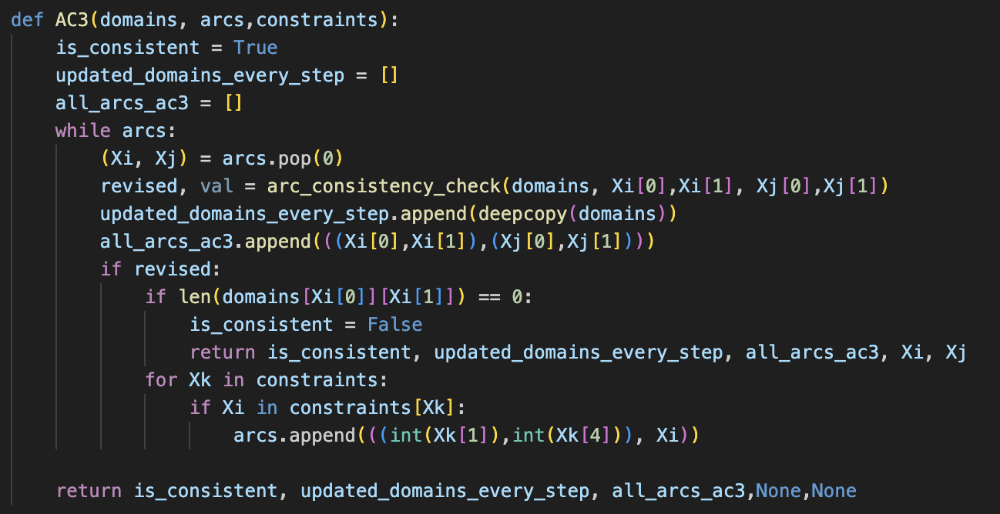
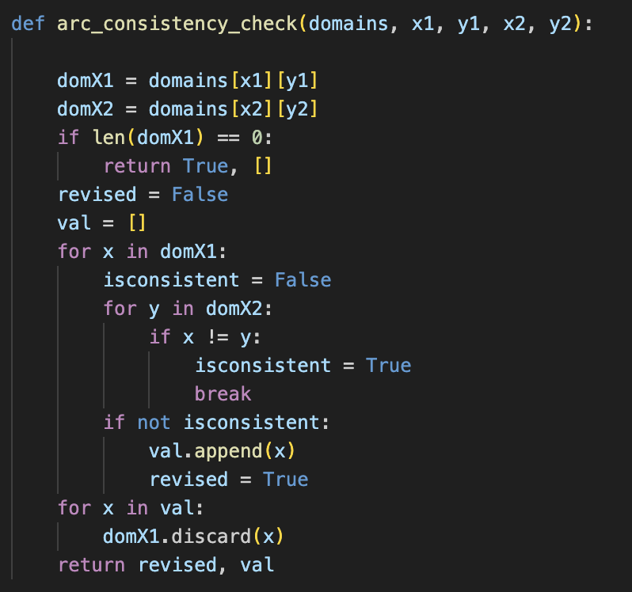
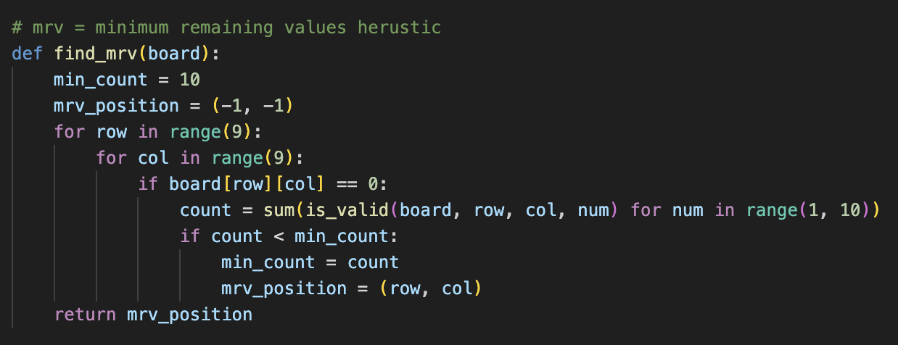
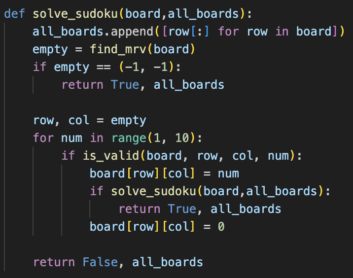
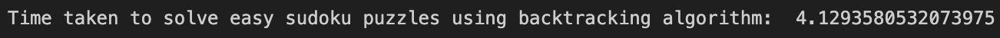
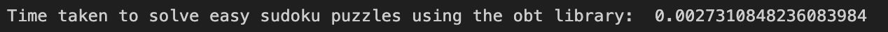
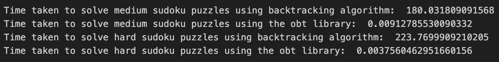
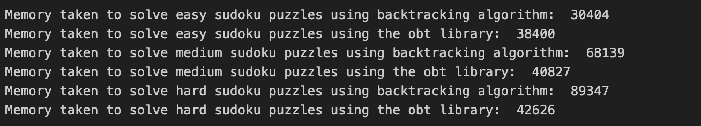
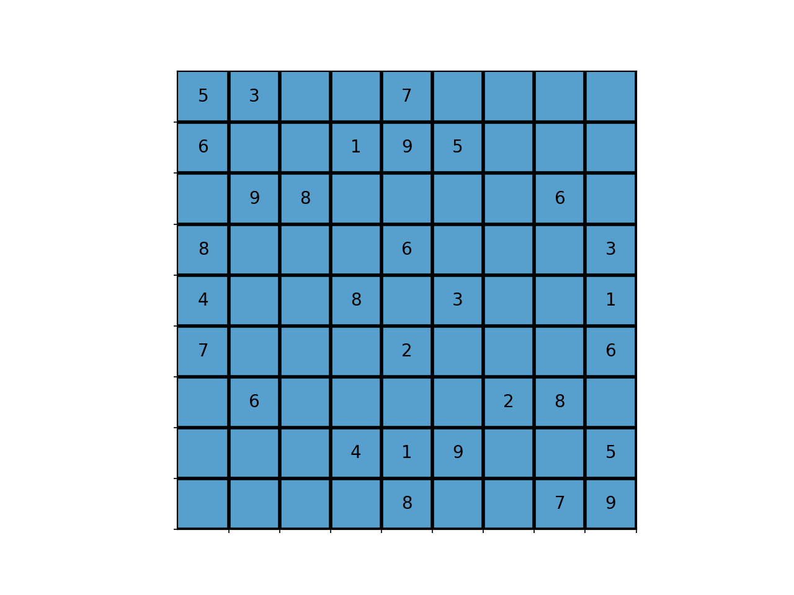

# Sudoku-Vision
### Foundations of AI: Multiagent Systems (2024)
- Jaidev Khalane (22110103)
- Vannsh Jani (22110279)

# 1. Aim
- To develop an application that solves Sudoku puzzles from images using the most optimal method for different difficulty levels (by adjusting the proportion of the problem that will be solved by Constraint satisfaction and Backtracking).
- To explore the usage of Reinforcement Learning in solving Sudoku puzzles

# 2. Methodology and Results
## 2.1 Sudoku Vision Application
### 2.1.1 Digit Optical Character Recognition
Since we aim to solve sudokus directly from the images (without requiring the user to manually type the sudoku digits), one of the most important tasks is to have a computer vision model for the classification of the given images of individual digits into their respective classes of digits. This is the task of Optical Character Recognition or OCR. In order to perform the task of OCR, we can either use the python library of EasyOCR or develop a model from scratch. We have taken the second approach. The dataset for the model was taken from kaggle <https://www.kaggle.com/datasets/kshitijdhama/printed-digits-dataset> [1]. Some images from the dataset are as given below: </br>


Model Architecture: </br>


Model Architecture Diagram: </br>


Model Training:
The training for the Digit Optical Character Recognition model was carried out for 20 Epochs. The training dataset consisted of 5669 images while the test dataset consisted of 630 images. The images were converted to grayscale with a size of 28x28.
The training statistics are as given below: </br>


Test Statistics: </br>


Model Usage: </br>


The trained model weights have been stored as .keras file and .h5 file in the DigitOCR folder.

### 2.1.2 Sudoku Extraction
As we are working with the images of the sudoku grid, we want to extract the values present in the grid of the sudoku as arrays instead of images. Therefore, in this part of the methodology, we will discuss the path taken by us in performing the extraction of the sudoku grid from the images. The sample image of the sudoku is as given below:
- #### Step 1: Image Capture
</br></br>
This is a general image of a sudoku taken from a newspaper (taken from library) without much cropping or enhancement.
- #### Step 2: Conversion to Grayscale
</br></br>
The image was converted to grayscale to efficiently use our DigitOCR model
- #### Step 3: Denoising the Image
</br></br>
The image was denoised with a gaussian kernel to remove the noise (high frequency components) from the image (Gaussian Blur)
- #### Step 4: Adaptive Thresholding
</br></br>
In order to perform contour analysis (As the sudoku grid is expected to be the largest contour, it is necessary to perform edge detection which will be done in a better way if we have a binary image. So, in order to perform the binarization of the image, we have used Adaptive thresholding which creates a threshold based on the image and sets the lower pixels to zero while the higher pixels to 255.
- #### Step 5: Edge Detection
</br></br>
Since the sudoku grid in general is made of 9x9 smaller numbers enclosed by a box, in order to find that box which encloses the number grid, it is necessary to find the edges of the box which are given by the edge detection algorithm. We have usef the canny edge detection algoithm in this case.
- #### Step 6: Contour Analysis
</br></br>
In an image, we define a contour to be some continuous curve that traverses the boundary of some object. So, since the sudoku grid has a continuous boundary, it also has a contour.
- #### Step 7: Maximum Contour Extraction
</br></br>
</br></br>
Assuming that the user intended to capture the Sudoku, the main grid of the sudoku should be at the focus and therefore, the contour corresponding to the main sudoku grid should enclose the largest amount of area. Therefore, the contour corresponding to the main sudoku grid was cropped and we obtain the image of only the main sudoku grid without the unnecessary background.
- #### Step 8: Digit Extraction
</br></br>
Since the division of the image of the grid of sudoku image into 9x9 squares led to the creation of the above image where the images corresponding to the individual digits also had the noise corresponding to the edges of the box enclosing the digits, we again performed the maximum contour extraction and realigning the images followed by cropping the boundaries and resizing of the the individual digit images to size 28x28 in grayscale. The results are as given below.
</br></br>
- #### Step 9: DigitOCR and Sudoku Image to Sudoku Array
The DigitOCR model was then run on the individual images of the digits of the sudoku image and the results were stored in a array. This program is given in the file Img2Arr.py in the folder Sudoku Extraction. The reults are as shown below:
Initial Sudoku Image:
</br></br>
Obtained Sudoku Array:
</br></br>

### 2.1.3 Sudoku Difficulty Classification
In the first part of the project, we have analysed the methodology for the extraction of sudoku from images, in this part of the project, we will explore the possibility of using an optimised mixture of CSP solving algorithm (Forward Checking) and Backtracking in obtaining the solution for varying difficulties of the Sudoku grid. In order to classify the difficulty of the sudoku grid, as we are dealing with constraints, a simple way of classiying the difficulty would be based on the number of zeros. If we have less number of zeros in the grid, there would be less flexibility in assigning the values and hence, we classified them as hard, while the ones with slightly more number of zeros were classified as medium and the ones with the most number of zeros were classified as easy. The dataset for the sudokus was taken from the website Sudoku Bank where the sudokus were available on https://github.com/grantm/sudoku-exchange-puzzle-bank in .json format. A total of 1500 sudokus were downloaded and used for the analysis.
</br></br>
This plot shows the distribution of the number of zeros across the different sudoku grids.
Based on the above plot, the difficulty classifier was executed and the results along with the code are as given below:
</br></br>
The sudokus were stored in the respective files named <difficulty_level>_sudoku.txt based on the difficulty level in the folder Sudoku Difficulty Classifier for further analysis.

### 2.1.4 Constraint Development
The aim of this part is to develop a mixture of the Forward checking CSP solver algorithm that would be followed by the traditional backtracking algorithm. The first part of this would require us to use a forward checking algorithm which would require us to develop a "constraint creator" algorithm which would create constraints from the given sudoku grid. For an empty location (0) in a sudoku grid, the contraints would be that the particular location in the grid cannot take the values that are already present in the same row, same column and the same 3x3 grid to which that "small box" belongs to. So, based on this, a constraint developer algorithm was developed as given below:
</br></br>
The grid given below was run through the above function:
</br></br>
The results from the constraint finder algorithm are as given below:
</br></br>

### 2.1.5 AC3
The AC3 algorithm was also developed which was also solving the CSP problem of Sudoku. But due to extremely slow procedure and time consuming nature of AC3, forwrd checking was used in actual implementation instead.
</br></br>
Following is the code for the function which checks arc consistency.
</br></br>

### 2.1.6 Forward Checking
</br> </br>
In order to ensure faster execution of constraint satisfaction algoritm, Forward Checking Algorithm was used for "iteration" number of iterations as given in the code above. In this, we check the constraint arcs from the assigned variables to restric the domains of the unassigned variables. The constraint with the minimum possibilities was extracted and assigned that value. This was done for "iteration" number of iterations. The results are as shown below:</br>
Original Sudoku Array:</br>
</br></br>
```solved_grid = forward_checking(sudoku_grid, constraints, 25)```</br>
Results after running Forward Checking for 25 Iterations:</br>
</br></br>

### 2.1.7 Backtracking
</br></br>
The traditional backtracking algorithm for solving the remaining sudoku grid after "n" iterations of the forward checking is as given above. In our algorithm analysis, we will analyse the tradeoffs between varying the n value for different difficulty levels with respect to execution time and dynamic memory consumption.
</br></br>
Given above is the result after solving the remaining Sudoku using Backtracking.

### 2.1.8 Optimized Backtracking
We have optimized the backtracking algorithm using the minimum-remaining-value (MRV) heuristic. In the backtracking algorithm, when selecting a variable to guess (assign) its value, we choose the variable with the least remaining values or the variable which has the most number of constraints. The intuition behind this is that the search space for this variable will be drastically less than a variable which is more flexible or is involved in lesser constraints. Following is the optimized backtracking algorithm with the MRV heuristic.
</br></br>
</br></br>

### 2.1.9 Algorithm Runtime Analysis
Following the standard execution time / performance measurement process, the program was run for five different values of "n" (the number of iterations for which the forward checking was run) three times and the mean of this times was taken. All the time values are calculated in nanoseconds. The time consumption was calculated using the time library (time_ns command) of python. The values are as given below:
#### 2.1.9.1 For Easy Difficulty

```
Mean Runtime for Easy, 10 iter, trial 1: 38.57733638888889
Mean Runtime for Easy, 10 iter, trial 2: 9.80619777777778
Mean Runtime for Easy, 10 iter, trial 3: 8.02532
Mean Runtime for Easy, 20 iter, trial 1: 10.24516361111111
Mean Runtime for Easy, 20 iter, trial 2: 7.345862222222222
Mean Runtime for Easy, 20 iter, trial 3: 7.129585277777778
Mean Runtime for Easy, 30 iter, trial 1: 8.338535833333331
Mean Runtime for Easy, 30 iter, trial 2: 7.754831666666666
Mean Runtime for Easy, 30 iter, trial 3: 7.692228333333333
Mean Runtime for Easy, 40 iter, trial 1: 7.943169166666666
Mean Runtime for Easy, 40 iter, trial 2: 7.40670861111111
Mean Runtime for Easy, 40 iter, trial 3: 8.021085555555555
Mean Runtime for Easy, 50 iter, trial 1: 9.114273888888889
Mean Runtime for Easy, 50 iter, trial 2: 7.93228861111111
Mean Runtime for Easy, 50 iter, trial 3: 8.578741111111109
```

##### Mean of All Trials

```
Mean Runtime for Easy, 10 iter: 18.80295138888889
Mean Runtime for Easy, 20 iter: 8.240203703703704
Mean Runtime for Easy, 30 iter: 7.928531944444444
Mean Runtime for Easy, 40 iter: 7.790321111111111
Mean Runtime for Easy, 50 iter: 8.54176787037037
```

#### 2.1.9.2 For Medium Difficulty
```
Mean Runtime for Medium, 10 iter, trial 1: 15.273029553264607
Mean Runtime for Medium, 10 iter, trial 2: 2.9854753722794958
Mean Runtime for Medium, 10 iter, trial 3: 2.506118213058419
Mean Runtime for Medium, 20 iter, trial 1: 4.1784522336769765
Mean Runtime for Medium, 20 iter, trial 2: 2.5116075601374566
Mean Runtime for Medium, 20 iter, trial 3: 2.3928760595647196
Mean Runtime for Medium, 30 iter, trial 1: 2.9906161512027487
Mean Runtime for Medium, 30 iter, trial 2: 2.2939569301260025
Mean Runtime for Medium, 30 iter, trial 3: 2.3736013745704474
Mean Runtime for Medium, 40 iter, trial 1: 3.125465177548683
Mean Runtime for Medium, 40 iter, trial 2: 2.502982588774341
Mean Runtime for Medium, 40 iter, trial 3: 2.650259793814433
Mean Runtime for Medium, 50 iter, trial 1: 3.2603886597938145
Mean Runtime for Medium, 50 iter, trial 2: 2.7966096219931273
Mean Runtime for Medium, 50 iter, trial 3: 2.7148237113402063
```
##### Mean of All Trials
```
Mean Runtime for Medium, 10 iter: 6.92154104620084
Mean Runtime for Medium, 20 iter: 3.0276452844597173
Mean Runtime for Medium, 30 iter: 2.552724818633066
Mean Runtime for Medium, 40 iter: 2.759569186712486
Mean Runtime for Medium, 50 iter: 2.9239406643757158
```

#### 2.1.9.3 For Hard Difficulty
```
Mean Runtime for Hard, 10 iter, trial 1: 3.387571535580525
Mean Runtime for Hard, 10 iter, trial 2: 0.2921269662921348
Mean Runtime for Hard, 10 iter, trial 3: 0.17943258426966294
Mean Runtime for Hard, 20 iter, trial 1: 1.523129213483146
Mean Runtime for Hard, 20 iter, trial 2: 0.27799999999999997
Mean Runtime for Hard, 20 iter, trial 3: 0.22899925093632956
Mean Runtime for Hard, 30 iter, trial 1: 1.0907955056179774
Mean Runtime for Hard, 30 iter, trial 2: 0.31465955056179773
Mean Runtime for Hard, 30 iter, trial 3: 0.28845243445692886
Mean Runtime for Hard, 40 iter, trial 1: 0.8789086142322098
Mean Runtime for Hard, 40 iter, trial 2: 0.24568876404494383
Mean Runtime for Hard, 40 iter, trial 3: 0.22452172284644198
Mean Runtime for Hard, 50 iter, trial 1: 0.9191022471910113
Mean Runtime for Hard, 50 iter, trial 2: 0.2584801498127341
Mean Runtime for Hard, 50 iter, trial 3: 0.28364044943820227
```
##### Mean of All Trials
```
Mean Runtime for Hard, 10 iter: 1.2863770287141076
Mean Runtime for Hard, 20 iter: 0.6767094881398252
Mean Runtime for Hard, 30 iter: 0.5646358302122346
Mean Runtime for Hard, 40 iter: 0.44970636704119854
Mean Runtime for Hard, 50 iter: 0.4870742821473159
```
##### Graphical Representation of the Obtained Outputs


##### Performance comparison of Simple Backtracking and Optimized Backtracking

As expected we find that the optimized backtracking algorithm drastically outperforms the simple backtracking algorithm. Following are the results.

#### Time Comparison

We can see that optimized backtracking drastically outperforms backtracking.
</br></br>
</br></br>
</br></br>

#### Memory Comparison

We can see that for medium and hard sudokus, optimized backtracking takes less memory, while it is similar in the case of easy sudokus as there are lesser number of empty cells in easy sudoku.
</br></br>


### 2.1.10 Algorithm Dynamic Memory Consumption Analysis
The dynamic memory consumption analysis is necessary for effectively running the sudoku solver on devices with lower computing power such as mobile phones. In the same standard measurement process as that of execution time analysis, the program was run thrice and the amout of memory consumed was tracked by the command ```tracemalloc.get_traced_memory()``` from the tracemalloc library in python. The results are as shown below. The unit for the memory consumed is Bytes.
#### 2.1.10.1 For Easy Difficulty
```
Mean Memory for Easy, 10 iter, trial 1: 100576.71111111112 Unit: Bytes
Mean Memory for Easy, 10 iter, trial 2: 30832.069444444445 Unit: Bytes
Mean Memory for Easy, 10 iter, trial 3: 27132.430555555555 Unit: Bytes
Mean Memory for Easy, 20 iter, trial 1: 55456.96111111111 Unit: Bytes
Mean Memory for Easy, 20 iter, trial 2: 34098.544444444444 Unit: Bytes
Mean Memory for Easy, 20 iter, trial 3: 28171.80277777778 Unit: Bytes
Mean Memory for Easy, 30 iter, trial 1: 51113.669444444444 Unit: Bytes
Mean Memory for Easy, 30 iter, trial 2: 32070.82222222222 Unit: Bytes
Mean Memory for Easy, 30 iter, trial 3: 29962.480555555554 Unit: Bytes
Mean Memory for Easy, 40 iter, trial 1: 47173.48055555556 Unit: Bytes
Mean Memory for Easy, 40 iter, trial 2: 32452.144444444446 Unit: Bytes
Mean Memory for Easy, 40 iter, trial 3: 29995.86111111111 Unit: Bytes
Mean Memory for Easy, 50 iter, trial 1: 43094.580555555556 Unit: Bytes
Mean Memory for Easy, 50 iter, trial 2: 34092.15 Unit: Bytes
Mean Memory for Easy, 50 iter, trial 3: 29990.03888888889 Unit: Bytes
```
##### Mean of All Trials
```
Mean Memory for Easy, 10 iter: 52847.07037037038
Mean Memory for Easy, 20 iter: 39242.43611111111
Mean Memory for Easy, 30 iter: 37715.65740740741
Mean Memory for Easy, 40 iter: 36540.49537037037
Mean Memory for Easy, 50 iter: 35725.58981481481
```
#### 2.1.10.2 For Medium Difficulty
```
Mean Memory for Medium, 10 iter, trial 1: 80503.90950744558 Unit: Bytes
Mean Memory for Medium, 10 iter, trial 2: 22722.726231386026 Unit: Bytes
Mean Memory for Medium, 10 iter, trial 3: 18928.449026345934 Unit: Bytes
Mean Memory for Medium, 20 iter, trial 1: 44963.575028636886 Unit: Bytes
Mean Memory for Medium, 20 iter, trial 2: 24814.479954180984 Unit: Bytes
Mean Memory for Medium, 20 iter, trial 3: 22341.759450171823 Unit: Bytes
Mean Memory for Medium, 30 iter, trial 1: 36318.00114547537 Unit: Bytes
Mean Memory for Medium, 30 iter, trial 2: 22710.625429553264 Unit: Bytes
Mean Memory for Medium, 30 iter, trial 3: 23828.142038946164 Unit: Bytes
Mean Memory for Medium, 40 iter, trial 1: 32950.955326460484 Unit: Bytes
Mean Memory for Medium, 40 iter, trial 2: 26248.47651775487 Unit: Bytes
Mean Memory for Medium, 40 iter, trial 3: 23708.843069873998 Unit: Bytes
Mean Memory for Medium, 50 iter, trial 1: 37495.52806414662 Unit: Bytes
Mean Memory for Medium, 50 iter, trial 2: 28615.563573883162 Unit: Bytes
Mean Memory for Medium, 50 iter, trial 3: 26584.359679266894 Unit: Bytes
```
##### Mean of All Trials
```
Mean Memory for Medium, 10 iter: 40718.361588392516
Mean Memory for Medium, 20 iter: 30706.604810996567
Mean Memory for Medium, 30 iter: 27618.922871324932
Mean Memory for Medium, 40 iter: 27636.091638029786
Mean Memory for Medium, 50 iter: 30898.483772432228
```
#### 2.1.10.3 For Hard Difficulty
```
Mean Memory for Hard, 10 iter, trial 1: 51694.60299625468 Unit: Bytes
Mean Memory for Hard, 10 iter, trial 2: 5456.838951310861 Unit: Bytes
Mean Memory for Hard, 10 iter, trial 3: 6240.602996254682 Unit: Bytes
Mean Memory for Hard, 20 iter, trial 1: 34690.41947565543 Unit: Bytes
Mean Memory for Hard, 20 iter, trial 2: 7461.483146067416 Unit: Bytes
Mean Memory for Hard, 20 iter, trial 3: 8523.430711610486 Unit: Bytes
Mean Memory for Hard, 30 iter, trial 1: 24540.696629213482 Unit: Bytes
Mean Memory for Hard, 30 iter, trial 2: 8139.7191011235955 Unit: Bytes
Mean Memory for Hard, 30 iter, trial 3: 8129.940074906367 Unit: Bytes
Mean Memory for Hard, 40 iter, trial 1: 16608.037453183522 Unit: Bytes
Mean Memory for Hard, 40 iter, trial 2: 8202.059925093634 Unit: Bytes
Mean Memory for Hard, 40 iter, trial 3: 8201.602996254682 Unit: Bytes
Mean Memory for Hard, 50 iter, trial 1: 12225.707865168539 Unit: Bytes
Mean Memory for Hard, 50 iter, trial 2: 8755.153558052434 Unit: Bytes
Mean Memory for Hard, 50 iter, trial 3: 9861.2734082397 Unit: Bytes
```
##### Mean of All Trials
```
Mean Memory for Hard, 10 iter: 21130.681647940077
Mean Memory for Hard, 20 iter: 16891.777777777777
Mean Memory for Hard, 30 iter: 13603.451935081148
Mean Memory for Hard, 40 iter: 11003.900124843945
Mean Memory for Hard, 50 iter: 10280.711610486891
```
##### Graphical Representation of the Obtained Outputs


### 2.1.11 Overall Result for Algorithm Analysis
#### 2.1.11.1 For Easy
</br>
As we can see the plots of Memory Consumption and the Execution Time required against the number of iterations "n" for which we are running the forward checking algorithm, we can see that in general the Execution Time and the Memory Consumed reduce with n. However, After 40, there is certain tradeoff that is seen, that is, the runtime shows slight increase. The point of crossing, that is near n = 45 can be considered to be optimal with respect to both Runtime and Memory Consumed.

#### 2.1.11.2 For Medium
</br>
In this plot of Memory Consumption and Runtime against the value of "n", we can see that as the value of n increases from 10 to 30, both the parameters under consideration show a decrease. However, when we increase the value of n beyond 30, both the parameters under consideration show a tremendous increase, which leads us to the conclusion that the global minimum for both the memory consumed and the execution time taken is at n = 30. 

#### 2.1.11.3 For Hard
</br>
From the above plot of Memory Consumption and the Execution Time required against the number of iterations "n" for which we are running the forward checking algorithm, we can again see that in general the Execution Time and the Memory Consumed reduce with n. However, After 40, there is certain tradeoff that is seen, that is, the runtime shows slight increase. The point of crossing, that is again near n = 45 can be considered to be optimal with respect to both Runtime and Memory Consumed.

#### Summary of Observed Results
From the above analysis, we can see that the value of n (the number of iterations we are running the Forward Checking Algoruthm followed by filling the remaining spaces by Backtracking) can be tabulated as given below:
| Difficulty  | Value of n  |
| ----------- | ----------- |
| Easy        | ~45         |
| Medium      | ~30         |
| Hard        | ~45         |

### 2.1.12 Sudoku Vision: Streamlit Application
In oreder to provide a suitable user interface for the user to utilise our methodology adopted for *Solving Sudokus from Images*, we have developed a web application using the streamlit framework. Streamlit is a flexible framework in python that allows us to develop applications in Python along with styling using HTML, CSS and JS. It also allows us to deploy the application on streamlit cloud. The link to the application is: <ADD LINK>

#### CLI Application
A basic Command Line Interface application is also developed which requires the user to clone this repository and run the CLI file using the command: ```python3 CLI.py```. The usage of the application is as shown below:


#### Web Appllication
The Web Application using Streamlit can be accessed using the link given above. The application can also be used locally on a desktop system by cloning this repository. The advantage of a web application deployed is that it can be used from any device with internet connection including Mobile Phones. The usage of the Web Application is as shown in the images below:
##### Backtracking Application


https://github.com/user-attachments/assets/907f31e9-87f2-4d27-a05e-6f5f16b728e7


##### Forward Checing Application


https://github.com/user-attachments/assets/a28b70c6-8962-49c8-8d4d-867433a08428


##### Optimal Solving Application

https://github.com/user-attachments/assets/288e96be-08fe-4c02-9533-becd8bbcdbfd


##### AC3 Application

https://youtu.be/v-z_XBH--CE

##### Optimized Backtracking Application and Animation
https://youtu.be/R_X2WlvyoNA



# References and Acknowledgements
- Foundations of AI: Multiagent Systems (2024) - IIT Gandhinagar
- Documentations of Utilised Libraries
- Stack Overflow (for debugging)


